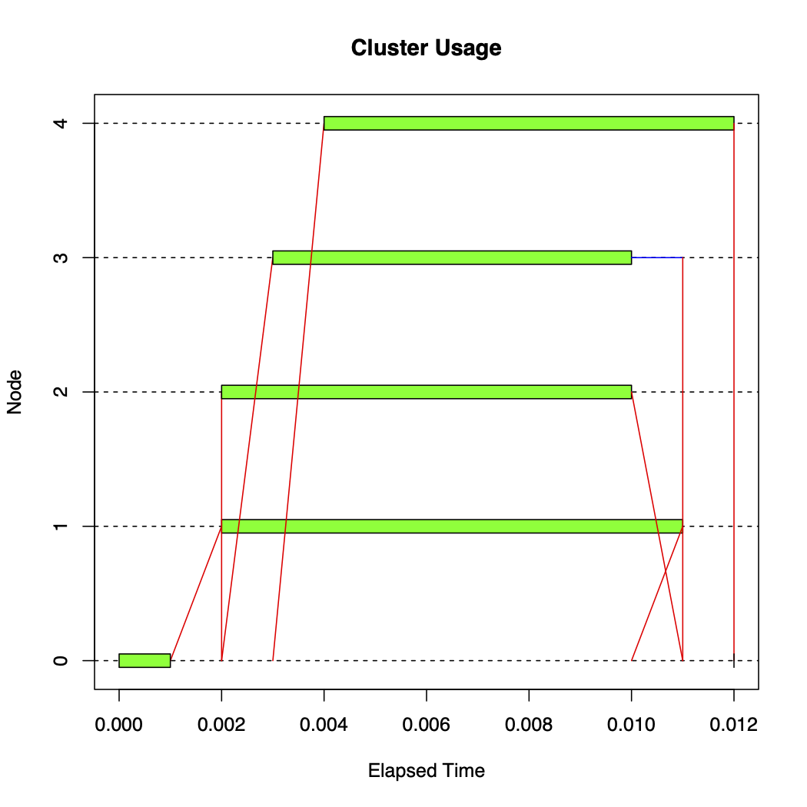

# RSienaTest MPI Optimisation Report

**ADACS Project SNA_2021B**

## Test problem
The `Karen` test problem was used to benchmark the `RSienaTest` package. The `setup.Karen.R` routine allows for the network size (`n`) and number of networks (`M`) to be adjusted. This routine runs a specified number of pre-warming, warming, and main steps, producing a checkpoint file which can then be called on to run individual "timesteps" that can be profiled.

The number of networks sets an upper limit on the number of concurrent tasks. For example, with `M=4`, the maximum number of tasks that can run in parallel is 4. The network size sets the size of the unit of work performed by a task.

Having a test problem easily adjustable problem size parameters enables the code to be quickly profiled by targeting the hotspots, without having to wait for a long run (which may take hours or days) to finish running.

The target is to run problems with size `N ~ O(100)` and `M ~ O(100)` within walltimes of a couple of days or weeks on a supercomputer. Scaling up to several hundred cores would be desirable, and would be an improvement over the current single-node limitation.

## Existing parallel implementation
The `RSienaTest` packages uses of the `snow` library for parallelism. The `snow` library implements "master-slave" parallelism, where the master task serialises R functions and arguments and sends them to slave tasks to unserialise and perform the work, which then serialise and return the results to the master. In this implementation, the master task performs no work during parallel sections of the code, and is only responsible for distributing work and collating the results.

The `snow` library uses one of several communication methods:
* Socket communication between processes on the same machine or several machines (`SOCK`)
* Process forking for each task on the same machine (`FORK`)
* Message Passing Interface (MPI), the standard for exchanging messages between tasks on the same machine or across several machines, used by most supercomputer applications

Previously, the method used by the science team is `FORK`, because it requires minimal setup. For the code to scale on a supercomputer, however, using MPI is a necessity.

The MPI implementation in `snow` is built on the `Rmpi` library, an R wrapper for MPI functions in C.

## Profiling and optimisation strategy
Given that the code already has an option for running with MPI, the most straightforward solution is to set the communication method of `snow` to `MPI`.

A small test problem with `n=10` and `M=4`, run for 3 iterations showed that `MPI` performed significantly worse than `SOCK`.

Table 1: Timing comparison of communication methods
| Method     | Run time (s) |
|------------|--------------|
| FORK       | 191          |
| SOCK       | 191          |
| MPI        | 840          |

It is much more complicated to gather detailed timing with `FORK` compared to `SOCK`, and since `FORK` and `SOCK` run with similar wall times, we use `SOCK` for the following comparison.

Figure 1. Gantt Chart of SOCK communication with 4 slave tasks
{width=250}

Figure 2. Gantt chart of MPI communication with 4 slave tasks


Figures (1) and (2) are Gantt charts showing the timing breakdown for one iteration. The red lines indicate time spent performing send and receive operations, the green bars indicate time spent performing computations, and the blue lines indicate time spent waiting for a send operation to begin. An MPI iteration takes over 50 times longer to complete, due to massive communication overheads. Because the communication operations must run in serial, the entire code is forced to run in serial.

The send and receive methods in `Rmpi` consist of three main steps:

1. Serialisation/unserialisation of the R object into a bytestream that can be handled by MPI
2. The R garbage collector, invoked using `gc()`
3. The `MPI_SEND` and `MPI_RECV` calls

Table 2: Timing breakdown during send MPI operation when using MPI

|                    | Time (s)   | Fraction (%) |
|--------------------|------------|--------------|
| Serialisation      | 5.15e-4    | 0.54         |
| MPI send operation | 7.08e-5    | 0.080        |
| Garbage collection | 9.45e-2    | 99.38        |

Several causes of poor performance have been identified, and solutions proposed:

### Unecessary serialisation calls
The main work function `getProbabilitiesFromC` is serialised individually for each task, with every iteration of the loop, even though the function remains unchanged for the duration of the program.

Unecessary serialisation can be eliminated by serialising `getProbabilitiesFromC` once at the beginning of the creation of the slave tasks, and making it permanently available in their environment.

The input matrix `thetaMat` and other arguments `index` and `getScores` are also serialised individually for each task, even though it remains unchanged during each iteration.

Unecessary serialisation can be eliminated by serialising these arguments once at the beginning of each iteration and communicating the same bytestream to each slave task.

Implementing this solution requires moving the serialisation call from the `Rmpi` library (which the `snow` library loops over) into a call that happens before the loops over the send calls. New functions have been defined in `fastCluster.r`:
* `clusterExport.mpi.fast`: Makes an R object (in this case, `getProbabilitiesFromC`) available in the slave's environment.
* `clusterEvalQ.SplitByRow`: Evaluate an expression on each slave task, with a different argument on each task. The arguments are generated by performing a uniform domain decomposition on an input list. This function allows `getProbabilitiesFromC` (which already exists in the slave's environments) to be executed without having to send the function over again.

### Excessive invocation of garbage collector
The garbage collector, which is manually called after each `MPI_SEND` call in the `Rmpi` library, may occasionally (and stochastically) take a long time. When it activates during a send or receive call, it forces other communication calls to wait, severely negating parallel performance.

The manual garbage collection call after `MPI_SEND` can be removed. Tests show that results remain unchanged, and no memory leaks were identified, since the garbage collector still activates occasionally outside of the parallel section based on other criteria.

### Use of blocking MPI send calls
`MPI_SEND` calls are serially bound because the work is distributed sequentially. The master task must wait until the package of work has finished sending to a given slave task before initiating the send to the next one.

Replacing the `MPI_SEND` call with the non-blocking equivalent `MPI_ISEND` call allows the master task to immediately proceed with the next send without waiting for the previous send to finish. Care must be taken to avoid modifying the send buffers before each send is complete, but this is not an issue in this implementation because a new send buffer is allocated by `snow` for each send call. Tests showed that results remain unchanged.

The `MPI_ISEND` function in `Rmpi` does not include a garbage collection call, so swapping to the non-blocking send also resolves the garbage collection issue.

## Results
After applying optimisations, the test problem ran in 23 seconds, down from 840s - a 36x speedup.

## Project delivery

The optimisations have been made available on the public github repository https://github.com/ADACS-Australia/RSienaTest. Changes are made relative to version 1.2-30 (July 13, 2021).

All new functions are contained within `fastCluster.r`, with small changes to `sienaBayes.r` to point to these new functions.

## Appendix: Running with MPI
Although the `snow` library provides methods to spawn MPI tasks dynamically, this is not supported on all HPC systems.

The standard method for running an MPI program is using `mpirun` (see https://www.open-mpi.org/doc/v4.0/man1/mpirun.1.php), which calls the same program on every MPI task (see SPMD parallelism; https://en.wikipedia.org/wiki/SPMD).

Calling
```
mpirun -n 4 Rscript call.Karen.R
```
does not achieve the desired result because it simply executes the same program 4 times in parallel.

In order to designate a master task which exclusively executes the main program and slave tasks which wait for work within the `snow` framework of parallelism, it is neccessary to use a wrapper script. We provide `mpi-Rscript` (https://github.com/ADACS-Australia/mpi-Rscript), which serves as a drop-in replacement for `Rscript`.

For example, the parallel equivalent for
```
Rscript call.Karen.R
```
is
```
mpirun -n 4 mpi-Rscript call.Karen.R
```

`sienaBayes` has been modified to detect the number of MPI tasks `N` at run time (if MPI is being used), and set `nbrNodes <- N-1`. This overrides the `nbrNodes` argument passed through to `sienaBayes`.
